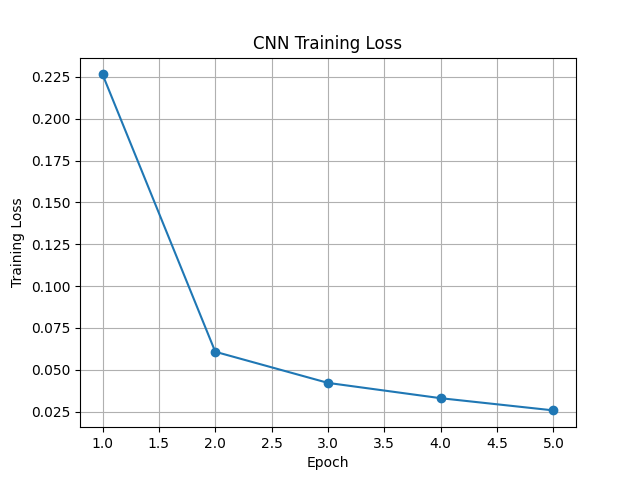
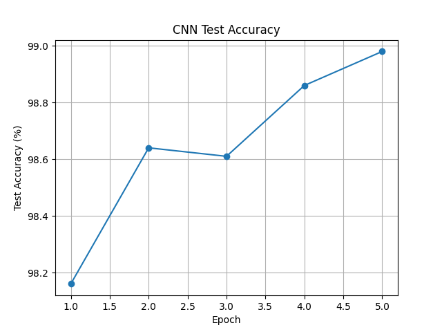
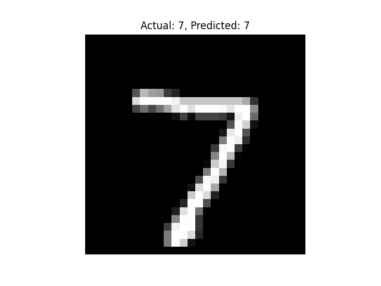
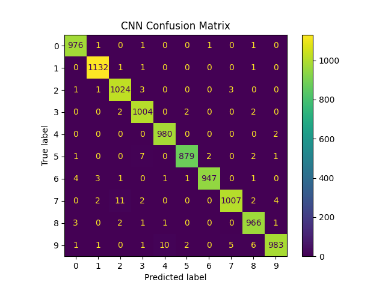

# Handwritten Digit Classification using PyTorch

A beginner-friendly deep learning project that classifies handwritten digits from the MNIST dataset using PyTorch. This project starts with a simple fully connected neural network and then upgrades the model to a Convolutional Neural Network (CNN) for better image classification performance.

---

## Project Overview

The goal of this project is to build and train deep learning models that can recognize handwritten digits from 0 to 9.

The project includes two versions:

| Version | Model Type | Description |
|---|---|---|
| Version 1 | Fully Connected Neural Network | A basic neural network that flattens each image into a vector |
| Version 2 | Convolutional Neural Network | An improved computer vision model using convolution and pooling layers |

---

## Technologies Used

- Python
- PyTorch
- TorchVision
- Matplotlib
- Streamlit
- Pillow
- MNIST Dataset

---

## Dataset

This project uses the MNIST dataset, which contains grayscale images of handwritten digits.

Each image has:

```text
28 x 28 pixels
1 color channel
10 classes: digits 0 to 9
```

---

## Model 1: Fully Connected Neural Network

The first model uses a simple neural network architecture:

```text
Input Image 28x28
→ Flatten Layer
→ Linear Layer
→ ReLU
→ Linear Layer
→ ReLU
→ Output Layer with 10 classes
```

This model helped me understand the basic deep learning workflow, including dataset loading, tensor conversion, model creation, training, evaluation, and model saving.

---

## Model 2: Convolutional Neural Network

The second model upgrades the project to a CNN.

CNNs are better for image classification because they can learn spatial patterns such as edges, curves, and shapes.

CNN architecture:

```text
Input Image
→ Convolution Layer
→ ReLU
→ Max Pooling
→ Convolution Layer
→ ReLU
→ Max Pooling
→ Fully Connected Layers
→ Output Prediction
```

---

## Results

The CNN model achieved strong accuracy on the MNIST test dataset.

```text
Final CNN Test Accuracy: 98.67%
```

---

## Training Loss

The training loss decreased over epochs, showing that the model was learning from the training data.



---

## Test Accuracy

The test accuracy increased over epochs, showing that the CNN model improved its prediction performance.



---

## Prediction Example

The model can predict handwritten digits from the test dataset.



---

## Confusion Matrix

The confusion matrix shows how well the CNN model classified each digit from 0 to 9.



---

## Streamlit Web App

I also created a simple Streamlit web app where users can upload a handwritten digit image and the trained CNN model predicts the digit.

The app allows users to:

- Upload a digit image
- Preview the uploaded image
- Get the predicted digit
- View the prediction confidence

### Run the App Locally

```bash
python -m streamlit run app.py
```

or

```bash
streamlit run app.py
```

---

## Files in This Project

```text
pytorch-mnist-classifier/
│
├── app.py
├── mnist_classifier.py
├── mnist_cnn.py
├── mnist_cnn_with_plots.py
├── mnist_cnn_model.pth
├── cnn_training_loss.png
├── cnn_test_accuracy.png
├── cnn_prediction_example.png
├── cnn_confusion_matrix.png
├── README.md
├── requirements.txt
└── .gitignore
```

---

## How to Run This Project

### 1. Clone the repository

```bash
git clone https://github.com/shahnajmou/pytorch-mnist-classifier.git
cd pytorch-mnist-classifier
```

### 2. Create a virtual environment

```bash
python3 -m venv venv
source venv/bin/activate
```

### 3. Install dependencies

```bash
pip install -r requirements.txt
```

### 4. Run the basic neural network

```bash
python mnist_classifier.py
```

### 5. Run the CNN model

```bash
python mnist_cnn.py
```

### 6. Run the CNN model with plots

```bash
python mnist_cnn_with_plots.py
```

### 7. Run the Streamlit app

```bash
python -m streamlit run app.py
```

---

## What I Learned

Through this project, I learned:

- How to use PyTorch for image classification
- How to load and preprocess the MNIST dataset
- How tensors are used in deep learning
- How to build a fully connected neural network
- How to build a CNN model
- How convolution and pooling layers work
- How to train and evaluate a model
- How to visualize training loss and test accuracy
- How to create a simple Streamlit app for model prediction
- How to prepare a deep learning project for GitHub

---

## Future Improvements

Possible future improvements include:

- Improve the Streamlit app interface
- Allow users to draw digits directly in the app
- Compare fully connected neural network vs CNN accuracy
- Add more evaluation metrics
- Train on a more complex image dataset such as Fashion-MNIST or CIFAR-10
- Deploy the app online

---

## Project Status

Completed basic neural network, CNN upgrade, model evaluation, training visualizations, confusion matrix, and Streamlit app.
